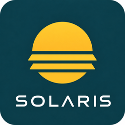

# Blind Control

## v0.7.4 Privacy source

Privacy follows the existing Core-State day_state: evening, late_evening,
early_night and late_night select the configured Privacy profile. No local clock
or new Core-Contracts connection is introduced. The former boolean Privacy
binding is retained only for rollback and is no longer consumed or suggested.
The older discovery description below is superseded for Privacy. Positive
Safety without a target is ready; Apply is idle and does not send a command.

Current contract for v0.7.3: [Issue #3](https://github.com/Levtos/blind_control/issues/3#issuecomment-5609119991).
The dimensional pipeline separates context, protections, modifiers, hard safety
and generation-bound writer gates. Horizon-first Night and canonical PC/TV
specificity supersede the historical global quality failure. Config v6 and
legacy status projections remain compatible. See [architecture](docs/ARCHITECTURE.md),
[migration](docs/MIGRATION.md) and the [operator-only live gate](docs/AP3_CUTOVER.md).
Apply OFF prevents new commands; it does not stop an already accepted physical
move. This patch is **Testing / Released / Not Live** after technical release;
the following older AP2/AP3 ownership statements are historical, not live evidence.

`blind_control` is the native Home Assistant integration for the Blind Control
rebuild. AP2 is live-verified in Shadow. AP3 adds an installable, guarded Apply
adapter while retaining Shadow as the migration-safe default.

The old `benni_blind_policy` integration remains the sole productive Apply
owner until Benni performs the separately gated atomic cutover. Installing this
release does not disable the old owner, rename an entity, or drive a cover.

Read the documents in this order:

1. [Lastenheft](docs/LASTENHEFT.md)
2. [Architecture](docs/ARCHITECTURE.md)
3. [Inventory](docs/INVENTORY.md)
4. [Contracts](docs/CONTRACTS.md)
5. [Migration and gates](docs/MIGRATION.md)
6. [AP2 Shadow implementation](docs/AP2_SHADOW.md)
7. [AP3 cutover and rollback runbook](docs/AP3_CUTOVER.md)

## Installation through HACS

Add `https://github.com/Levtos/blind_control` as a custom HACS integration
repository and install the latest published release. Restart Home Assistant,
then add **Blind Control** from **Settings → Devices & services**.

Fresh and upgraded entries default to `runtime_mode=shadow` and
`apply_owner=legacy`. The isolated writer is reachable only when Benni has
paused the old writer and deliberately combines `live`, `blind_control`, and
the Apply gate in **Blind Control → Overview → Operation**. The native OptionsFlow
remains available. Safety, restart readiness, manual
override, target stability and cooldown remain additional mandatory gates.

v0.7.0 adds the primary internal Core Contracts Consumer API for existing
Opening, Room Climate and Weather/Environment schemas, with explicit compatible
fallbacks for unselected or not yet implemented platform roles. Selected contracts
fail closed on missing or invalid evidence. The operator overview explains actual
position, current intent and inactive rules; diagnostics remain separate.
See [AP3_OPERATOR.md](docs/AP3_OPERATOR.md) for configuration, remaining role gaps,
staged Apply OFF/ON and the Legacy interlock. **Testing / Not Live** remains the
release status; installation and the real writer cutover belong to Benni.

## AP2 and AP3 boundary

**Current status:** `Installed / Shadow / Not Live`. AP2 is accepted. AP3 is a
technical release and runbook; it is not a live cutover.

- product/domain name: `Blind Control` / `blind_control`
- configurable normal/inverted profiles, axis inversion, geometry, and
  calibration defaults
- versioned owner-bound input, decision, diagnostic, UX, and Shadow contracts
- deterministic Solar Exposure, compatible minimum composition, exclusive
  Waking, shared `provisional_sleep`/`sleep` consumer semantics, Opening Safety,
  Override tracking, and latest-target cooldown state
- versioned hierarchy: `normal|manual|failure`, winner category/variant and
  visible compatible active or paused branches; Safety and Apply remain a
  separate technical layer
- Failure holds only a current/last proven safe position or blocks Apply; it
  never invents a 100 % open fallback; a quality gate also blocks an already
  composed daylight target when mandatory Temperature, Activity or
  geometry/Lux evidence is missing, unknown, unavailable, stale or conflicting;
  trend, model radiation and cloud evidence remain capability-aware additions
- native OptionsFlow Entity Selectors grouped for Core State,
  Opening/Safety/Cover, Solar, Temperature/Weather and Legacy comparison;
  contract-based installation-local prefill sets only resolved required or
  conditional owner bindings, while user choices and intentionally empty
  optional slots remain untouched; the panel shows only redacted readiness
  states for the v6 84-field contract (including the private Open-Meteo API
  URL); AP3 adds two OptionsFlow-only runtime/owner controls, for 86 fields in
  OptionsFlow while initial setup remains forced to safe Shadow defaults
- an isolated internal Open-Meteo coordinator performs one read-only request
  for current DNI and diffuse radiation every 900 seconds; it is configured
  entirely in ConfigFlow/OptionsFlow without YAML, secrets file, API key,
  coordinate form, PV model, Core-State change or new Weather-State integration
- the provider publishes `Blind Control DNI Instant` and `Blind Control Diffuse
  Radiation Instant` as registry-stable irradiance measurement sensors; an
  explicit external radiation binding remains the advanced override
- field-specific Core-State Presence/Activity/Day adapters, explicit Opening
  polarity, and standard-cover availability/current-position handling
- deterministic contract discovery prefers exact owner slugs/roles, data types,
  device classes and owner attributes; migrated 120-second settings cannot
  lower the 900-second Solar/Lux or 1800-second Temperature/Weather floors;
  healthy owner quality preserves stable measurements; Private-Time quality is
  read from field-specific Media-Activity evidence, so unrelated unknown
  Activity inputs do not block a fresh canonical `private` value, while stale
  or degraded Private-Time evidence remains blocking; dedicated
  `*_privacy_candidate` boolean contracts are preferred over generic blind
  masters
- HA 2026.8 `async_reload(entry_id)` lifecycle and Svelte-5-proxy-safe draft
  rebasing are contract-tested without a live reload or browser preview
- setup starts the owner-bound runtime coordinator and publishes a
  snapshot through a read-only WebSocket projection, one native diagnostic
  status sensor and two read-only radiation sensors on the same device; URL and
  coordinates are never projected; legacy entries without a saved provider URL use the local HA
  location only as a non-persistent runtime prefill
- guarded AP3 Apply boundary with explicit runtime mode, exclusive owner,
  Apply gate, restart baseline, Safety, Override and latest-target cooldown;
  Shadow remains physically non-actuating
- no entity flood, frontend device-command surface, cover movement, productive
  migration, Cutover, Rename, or live activation during development/release
- no hardcoded productive entity IDs in product Python code

`Live`, `Live Verified`, Cutover, Rename, Release, and Merge are separate
gates. The currently installed AP2 Shadow runtime does not make this Draft
follow-up live and does not change the old productive policy.

## AP3-Stabilisierung v0.6.0

Testing / Shadow / Not Live. Ein logischer Profilwert ersetzt die getrennten
Achsenprofile; die Migration verwendet bisherige Normal-Werte und erhält die
alten Paare. Cold braucht frischen Lux unter konfigurierbaren 400 lx.
Safety, Runtime-Stop und evidenzbasierter Bewegungsabschluss sind abgesichert.
Historischer v0.6.0-Stand; der folgende Hardening-Vertrag ist aktuell.
Details: [Entscheidung](docs/AP3_STABILIZATION.md),
[Config-Migration](docs/MIGRATION.md), [Cutover/Rollback](docs/AP3_CUTOVER.md).

## Hardening v0.6.1

Reale HA-Handlerfehler werden mit blocking=True erkannt; physische
Zielerreichung bleibt separat zu belegen. Fehlerhafte eigene Bewegungen können
nach frischer stabiler Ruhe kontrolliert auf die Istposition rebasieren.
Heat/Glare/Cold erhalten Hysterese und asymmetrische Stabilisierung unabhängig
vom Apply-Cooldown. opening/closing werden bei numerischer Achseninvertierung
nicht gespiegelt. Config v6 lädt v0.6.0 ohne Verlust bestehender Kalibrierung;
neue Werte und Versionsrollback stehen in MIGRATION.md.

**Testing / Shadow / Not Live.** Neues unabhängiges read-only Quality Gate aus
frischem Kontext erforderlich. Erst nach PASS installiert Benni v0.6.1 und
sammelt neue Shadow-Evidence. Keine Installation oder HA-Live-Änderung durch
diese technische Veröffentlichung.

## Unicorn Station branding

**SOLARIS** is the product brand. See [asset provenance and HA display conventions](brand/README.md). Technical identities and behavior remain unchanged.
